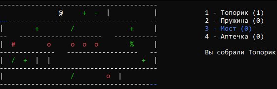
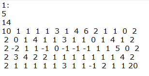

# MazeGame
Консольная игра про подземный лабиринт, главная фишка которого — нельзя изменить своё направление движения после перехода на новый этаж.
Цель — дойти до финиша, в чём вам помогут следующие предметы:

`/` — *Топорик*, прорубает проход в стене или в полу.

`%` — *Пружинка*, поднимает вас на этаж выше, если есть проход в потолке.

`-` — *Мост*, позволяет пройти над отверстием в полу.

`+` — *Аптечка*, прибавляет вам 1 здоровье (точнее, автоматически лечит при взрыве бомбы).

`o` — *Бомба*, отнимает одно здоровье (аптечку), или убивает, если аптечек нет.

`#` — *Динамит*, убивает сразу, полностью и непоправимо.

Так же возможно *разбиться* насмерть, упав сразу через 2 этажа. Падение через один этаж отнимает здоровье.



## Управление

Игрок обозначается символом `@`, перемещаться им можно с помощью стрелок на клавиатуре.

Для выбора предмета из инвентаря используются цифры `1-4`, активный предмет подсвечивается синим.

После смерти игрок обозначается `&` и не имеет возможности ходить.

Для перезапуска уровня можно нажать клавишу `esc`.

## Создание уровней
Все уровни располагаются в файле ***Lab.bin***, его можно открыть как текстовый файл.

Оформляются уровни в следующем виде.
```
№_уровня:
Кол-во_этажей
Число_элементов_на_этаже
  предметы на 1-ом этаже через пробел
  предметы на 2-ом этаже и т.д.
```
Элементы кодируются следующими цифрами:

0 — дыра в полу, 1 — просто пол, 2 — вертикальная стенка,

3 — топорик, 4 — аптечка, 5 — пружинка, 6 — мост,

-1 — бомба, -2 — динамит,

10 — место появления игрока, 20 — место финиша.


